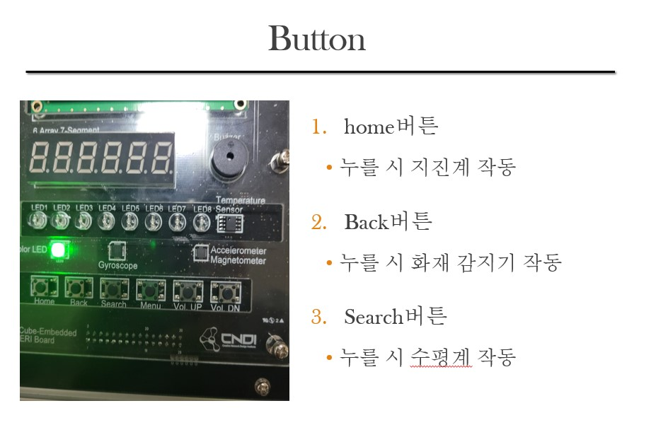

# Embedded_Project

## 목차
1. [개요](#1-개요)
2. [사용 키트](#2-사용-키트)
3. [블록도](#3-블록도)
4. [플로우차트](#4-플로우차트)
5. [주요 기능 구현 방식](#5-주요-기능-구현-방식)
6. [구현 기능](#6-구현-기능)

## 1. 개요

- 리눅스 환경 아래에서 시스템 콜 함수를 통해 산업 재해 상황을 관측할 수 있는 멀티 쓰레드 프로그램을 구현했다.

</br>

- 가속도 계 값을 받아 실시간 그래프를 구현해 사용자가 알기 쉽게 지진계의 상태를 관측할 수 있다.

## 2. 사용 키트

- [eCube Embedded All-In-One](http://www.cndi.co.kr/cndi/board/bbs/board.php?bo_table=imbe&wr_id=1)

</img>

- 세부 스펙 (소프트웨어 및 하드웨어)

</img>

## 3. 블록도


## 4. 플로우차트


## 5. 주요 기능 구현 방식

##### [ **가속도계 값을 통한 실시간 그래프 구현** ]

###### (1) 개요
프로젝트에서 실시간 그래프 화면을 구현하기 위해서는 LCD 화면을 수정해야했다.
LCD 화면을 수정하기 위해 프레임버퍼 디바이스 드라이버를 사용했다.

> **프레임 버퍼?**
> Frame Buffer는 커널에서 한 화면을 구성하기 위해 할당 해놓은 메모리.
> 그래픽 하드웨어를 사용자 레벨의 응용 프로그램이 제어할 수 있도록 만들어 놓은 것이
> **`프레임 버퍼 드라이버`** 이다.

###### (2) 프레임 버퍼 데이터 불러오기

프레임버퍼 드라이버를 불러오기 위해서는 `"/dev/fb0"` 파일을 오픈해야한다.
```
	if( (fbfd = open(FBDEV_FILE, O_RDWR)) < 0)
    {
        printf("%s: open error\n", FBDEV_FILE);
        return -1;
    }
```

이후, `ioctl( )` 함수를 통해 필요한 커널 영역의 버퍼를 불러왔다.

```
    if( ioctl(fbfd, FBIOGET_VSCREENINFO, &fbInfo) )
    {
        printf("%s: ioctl error - FBIOGET_VSCREENINFO \n", FBDEV_FILE);
		close(fbfd);
        return -1;
    }
   	if( ioctl(fbfd, FBIOGET_FSCREENINFO, &fbFixInfo) )
    {
        printf("%s: ioctl error - FBIOGET_FSCREENINFO \n", FBDEV_FILE);
        close(fbfd);
        return -1;
    }
```


## 6. 구현 기능

- **가속도계 값을 통한 실시간 그래프 구현**
- 버튼을 통한 메뉴 구현
- 가속도계 센서를 통해 진동 감지 후 위험 상황 표시
- 온도 센서를 통해 온도 감지 후 위험 상황 표시

[관련 사진]

- 실시간 그래프

</br>


- 각종 센서 기능

| 센서        | 사진                                   |
| ----------- | -------------------------------------- |
| 터치 스크린 |   |
| 버튼        |             |
| 부저        |             |
| 가속도 센서 |  |
| 자이로 센서 |                 |
| 온도 센서   |   |
| LED         |                   |
| COLOR LED   |               |
| FND         |                   |
| TEXT LCD    |             |
